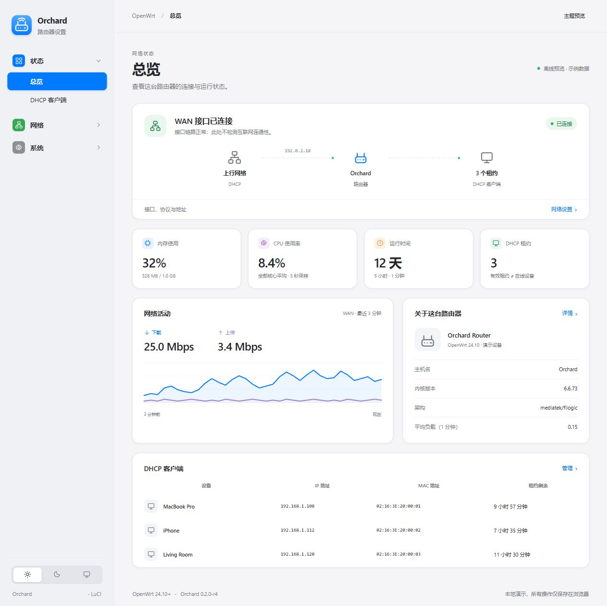

# Orchard 0.2.0-r5

面向 OpenWrt 24.10 及之后版本的 LuCI 主题。界面借鉴 macOS 系统设置的分组、侧栏、圆角和控件层级，采用原生 HTML、CSS 与 JavaScript。路由器无需安装 Node.js，也不依赖 CDN、在线字体或前端框架。


[](https://github.com/tcpqueue/luci-theme-orchard/actions/workflows/ci.yml)

[下载发布版本](https://github.com/tcpqueue/luci-theme-orchard/releases/latest) · [检查记录](VALIDATION.md) · [反馈问题](https://github.com/tcpqueue/luci-theme-orchard/issues)



浅色界面预览，使用示例数据。深色与手机界面见 [深色预览](docs/images/desktop-dark.jpg)、[手机预览](docs/images/mobile-light.jpg)。

GitHub Releases 提供已经验证的 `.ipk`、源码压缩包与 `SHA256SUMS`。以下安装示例使用通用地址 `192.168.1.1`，请换成自己的路由器地址。

## 功能

- 浅色、深色和跟随系统；外观偏好保存在当前浏览器。
- 按 LuCI 返回的菜单与权限生成侧栏，支持插件菜单和多级页签。
- 统一原有 LuCI 表单、表格、按钮、接口卡片、提示与弹窗样式。
- 手机使用抽屉导航，支持键盘操作、焦点提示和减少动态效果。
- 附带只读总览页：WAN 链路、接口流量、CPU 使用率、内存、负载、运行时间、IPv4 DHCP 租约及设备信息。
- 原生状态概览在宽屏显示系统与内存、存储两栏，窄屏回退单栏。
- nftables 防火墙状态使用规则链卡片、分组说明和规则标签。
- 保留原有 LuCI 状态页、配置流程和保存应用机制。

总览页位于 **状态 → Orchard**，不替换 LuCI 默认入口。切换回其他主题时，该入口会提示选择 Orchard，不加载主题的状态面板。

## 先预览

直接打开 `preview/index.html`，或在本目录执行：

```sh
node preview/server.mjs
```

打开 <http://127.0.0.1:8765>。预览包含总览、DHCP 客户端、网络接口、无线网络和系统设置。预览页使用示例数据，保存操作只写入浏览器，不连接路由器。实际主题中的配置页由 LuCI 提供。

## 在测试机上安装

安装前需已具备现代 LuCI、`luci-mod-status` 与 `rpcd-mod-file`。仅含旧版 Lua 模板的 LuCI 不在此版本的适配范围内。

OpenWrt / ImmortalWrt 24.10 推荐使用 `.ipk`。本次软件包由 OpenWrt 24.10.4 官方 SDK 编译，已经在 ImmortalWrt 测试机实际安装、升级、卸载和重新安装。软件包架构为 `all`，界面资源不含平台相关的可执行程序。

上传软件包：

```sh
scp -O luci-theme-orchard_0.2.0-r5_all.ipk root@192.168.1.1:/tmp/
```

在路由器上安装并激活：

```sh
opkg install /tmp/luci-theme-orchard_0.2.0-r5_all.ipk
sh /usr/libexec/orchard/activate.sh
```

安装软件包只注册主题；激活由脚本或 LuCI 的主题选择完成。普通升级保留当前主题，卸载当前启用的 Orchard 时回退到原主题。资源 URL 带完整版本号，升级时刷新主题样式与菜单模块缓存。

### 源码安装

源码安装不向 opkg/apk 登记软件包，不能与包管理器安装混用。已安装 `.ipk` 时，请使用软件包升级。以下方式适合开发或尚未提供原生软件包的系统。

将发布压缩包上传至路由器的 `/tmp`。如 Dropbear 没有 SFTP，可使用 SCP 传统模式：

```sh
scp -O luci-theme-orchard-0.2.0-r5.tar.gz root@192.168.1.1:/tmp/
```

登录路由器后执行：

```sh
tar -xzf /tmp/luci-theme-orchard-0.2.0-r5.tar.gz -C /tmp
sh /tmp/luci-theme-orchard/scripts/install.sh --activate
```

不加 `--activate` 时只安装和注册主题。随后可在 **系统 → 系统 → 语言和界面 → 主题** 选择 Orchard。使用 `--activate` 时会先把原主题路径保存到 `/etc/orchard-theme.previous`。它只改变 LuCI 的外观设置，不修改网络、防火墙、无线或密码。

安装脚本会重载 rpcd，以使菜单及只读权限生效。重载后重新登录 LuCI，并用 Ctrl+F5 清除浏览器的旧样式缓存。

总览入口：

```text
http://192.168.1.1/cgi-bin/luci/admin/status/orchard
```

## 回退和卸载

回退到脚本激活前的主题，保留 Orchard 文件：

```sh
sh /usr/libexec/orchard/restore.sh
```

卸载主题：

```sh
sh /usr/libexec/orchard/remove.sh
```

卸载脚本会识别包管理器安装，交由 opkg/apk 卸载；源码安装则移除主题文件。也可以直接执行 `opkg remove luci-theme-orchard`。这些脚本保存在路由器上，重启后仍可使用。若手动在 LuCI 选择了主题而没有用激活脚本保存旧主题，可直接使用已安装的 Bootstrap 回退：

```sh
uci set luci.main.mediaurlbase=/luci-static/bootstrap
uci commit luci
```

仅在 `/www/luci-static/bootstrap` 存在时使用上述命令。源码安装和包管理器安装择一使用；包管理器安装应使用 opkg/apk 卸载。

## 编译为固件软件包

使用与目标 OpenWrt 版本一致的源码树或 SDK，先准备 LuCI feed，再把本目录复制到 `package/luci-theme-orchard`：

```sh
./scripts/feeds update luci
./scripts/feeds install -a -p luci
make menuconfig
make package/luci-theme-orchard/compile V=s
```

在 menuconfig 的 LuCI 主题分类选择 `luci-theme-orchard`。24.10 构建产物为 `.ipk`；采用 apk 的版本应由对应 SDK 构建其原生包。本次已完成 24.10.4 SDK 的 `.ipk` 构建，未提供或验证 `.apk`。

Windows/WSL 下应把源码复制到 Linux 原生目录（如 `~/projects/`）再运行构建。`/mnt/` 只用于文件传输。

## 状态数据的含义

- WAN“已连接”来自接口状态，不表示已完成互联网可达性探测。
- 流量取自活动 WAN 设备的字节计数，每 5 秒采样，图表最多保留 36 个样本。首个样本先建立基线；接口变化、计数器回零或重启后重新采样。
- 内存优先采用内核返回的可用内存；缺少该字段时由空闲、缓存与缓冲区估算。
- 系统负载为 1 分钟平均负载，不是 CPU 使用率。
- CPU 使用率读取 `/proc/stat`，按两次采样的计数差计算全部核心的平均忙碌时间；空闲和 I/O 等待不计入忙碌时间。首次显示需等待约 5 秒。原生状态概览也使用该采样，避免依赖不同固件的 `top` 输出格式。
- 客户端列表展示有效 IPv4 DHCP 租约；租约不等同于设备当前在线。IPv6-only 和静态地址设备不计入该数字。
- RPC 刷新失败时显示失败提示，保留上次数据。总览 ACL 只授予读取权限。

## 校验

```sh
node tests/status.test.mjs
node tests/menu.test.mjs
sh tests/staging.sh
```

第一项验证 CPU 与流量采样、轮询挂载与卸载、接口变化、计数器回零、无 WAN、重启、租约过期、只读 ACL 与 JavaScript 语法。第二项验证深层插件菜单的页签顺序、标准类名、URL 与选中状态。第三项验证 shell 语法、安装目录、回退脚本及离线安装保护。`DESTDIR` 可将主题装入临时目录，不能用来激活主题。

具体校验记录见 `VALIDATION.md`。自定义插件的私有 CSS 可能需要按页面补充适配；未经实机验证的固件与插件不声明完全兼容。

## 0.2.0 更新

- 修复 LuCI 立即启动轮询时，总览还未挂载便停止刷新的问题。
- 手机端原生表格在表格内部横向滚动，避免撑宽整个页面；弹窗打开时锁定背景滚动。
- 补充中文侧栏与外观控件文字，顶栏显示实际固件发行名称。
- 修复原生进度条数值被裁剪的问题，并补充基于内核计数的 CPU 使用率。
- 重做分段页签，保留完整名称与手机滑动；为时间同步按钮增加间距。
- 恢复插件标准页签类名、页面样式入口、固件与 LuCI 版本信息。
- 修复手机布局覆盖条件隐藏字段、输入验证红色提示的问题；抽屉支持焦点限制、背景锁定和 Esc 关闭。
- 使用完整发布版本刷新资源缓存，补齐真实软件包构建、升级和卸载流程。
- 对照 Bootstrap、OpenWrt 2020、Material 与 Argon 源码，完成本机可用原生页面、插件、深色、手机及登录复测。

## 文件结构

```text
htdocs/luci-static/orchard/        样式、图标、外观脚本与共用总览界面
htdocs/luci-static/resources/      LuCI 菜单模块与状态视图
ucode/template/themes/orchard/     LuCI ucode 页面模板
root/etc/uci-defaults/            主题注册
root/usr/share/luci/menu.d/       总览菜单
root/usr/share/rpcd/acl.d/         只读权限
root/usr/libexec/orchard/         持久化激活、回退与卸载脚本
scripts/                         源码安装与管理入口
preview/                         离线交互预览
tests/                           状态采样与安装校验
```

上游组件来源与授权见 `NOTICE`、`LICENSE`。

## 自动检查配置

仓库通过 `.github/workflows/ci.yml` 启用 GitHub Actions。每次推送和 Pull Request 自动检查状态采样与 JavaScript、插件菜单及安装脚本。工作流仅使用仓库读取权限，结果可在 [Actions](https://github.com/tcpqueue/luci-theme-orchard/actions) 查看。
